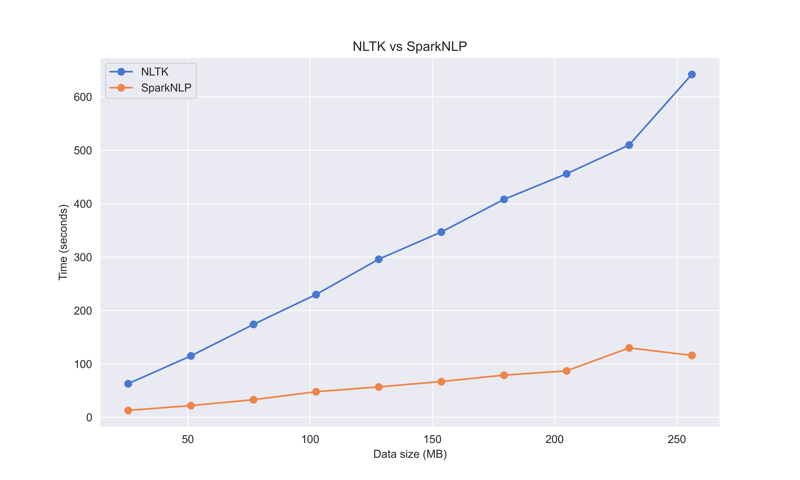
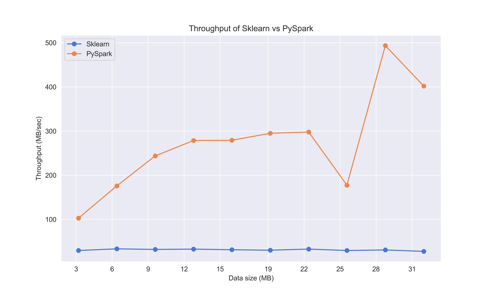

<h2 align="center"><strong>University of Economics Ho Chi Minh 

Big Data and Applications 
</strong></h2>

<p align="center">
  
</p>


# Group 09, Exploring Apache Spark's performance and its application in mining research topics on COVID-19

This repo represents the final project of group 09 for the course *Big Data and Applications*. In this project, we provide an in-depth analysis of Spark's performance based on time and throughput in comparison with NTLK and Scikit-learn. Additionally, we will also train and apply LDA model to discover latent topics related to COVID-19 using [CORD-19](https://www.kaggle.com/datasets/allen-institute-for-ai/CORD-19-research-challenge) on Kaggle.


## Repo overview
The folder structure of this repo is as follows:
```
└── 📁code
    └── evaluation.ipynb
    └── helper.py
    └── metrics.py
└── 📁data
    └── 📁merged
    └── 📁processed
└── 📁img
└── 📁model
```

The repo is divided into four folders, the `code/` folder contains the python code for the project. In detail, `evaluation.ipynb` is the notebook used to perform evaluation and discover latent topics, while `helper.py` contains essential functions for preprocessing and training preprocessing models, and `metrics.py` stores code for calculating metrics such as PUW.

The `data/` folder consists of two subfolders, `merged` and `processed`, `merged` contains 10000 papers extracted from [CORD-19](https://www.kaggle.com/datasets/allen-institute-for-ai/CORD-19-research-challenge) divided into three .json files, while `proceessed` is the TF-IDF feature of 10000 papers.


The `model/` folder archives four models used in this project,

- Pipeline model: a pyspark PipelineModel model, it takes a pandas.DataFrame as input and returns tokens of words.

- TF model: a pyspark CountVectorizer model, takes the result of pipeline model and returns term frequency of each word in a document.

- IDF model: a pyspark IDFModel model, takes the result of TF model an returns TF-IDF feautures.

- LDA model: the trained LDA model using TF-IDF features with the number of topics is 10.

## Getting started
These instructions will help you set up this project on local machine for scientific purposes and further developments

**Prerequisites**
This project utilises SparkNLP to process text data, but it only supports python version up to 3.10.x so your python version should be set to 3.10.x.

**Installing**
A `requirements.txt` is included to specify the necessary packages for running this project, using

`pip install -r requirements.txt`

to install and before downloading all the packages you should create a virtual environment for better experience

## Results
The performance of Spark is evaluated on execution time and throughput based on preprocessing steps with NLTK and training model with Scikit-learn, respectively.




## Deployment 
Feel free to download the model in `model\`, test on your own data and fine-tune it for better applications as the models are not fine-tuned yet.

## Contributing
Special thanks to our collaborators for their support in this project

1. Dương Gia Bảo

2. Nguyễn Thị Ngọc Diệp

3. Nguyễn Huy Hoàng

4. Lê Đình Anh Khoa 

5. Nguyễn Phúc Minh Trâm

## Acknowledgements
We would like to express our sincere gratitude to Dr. Nguyễn Mạnh Tuấn for his lectures in the course *Big Data and Applications*, for his guidance and support throughout the course. 