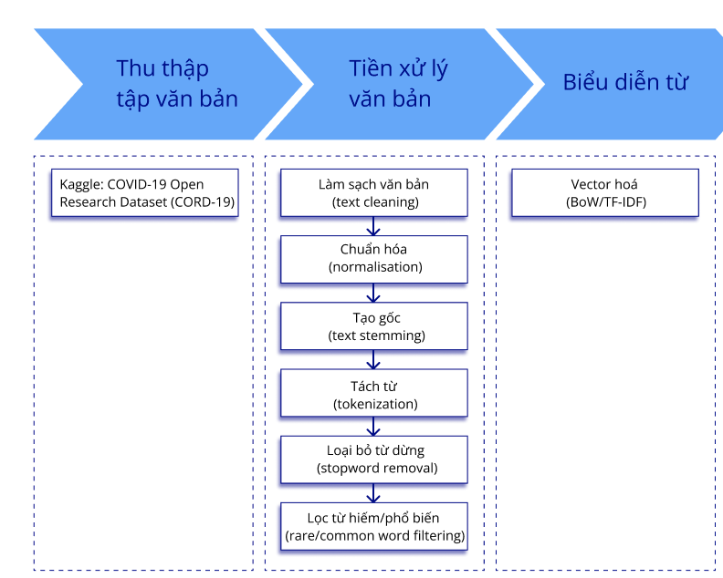
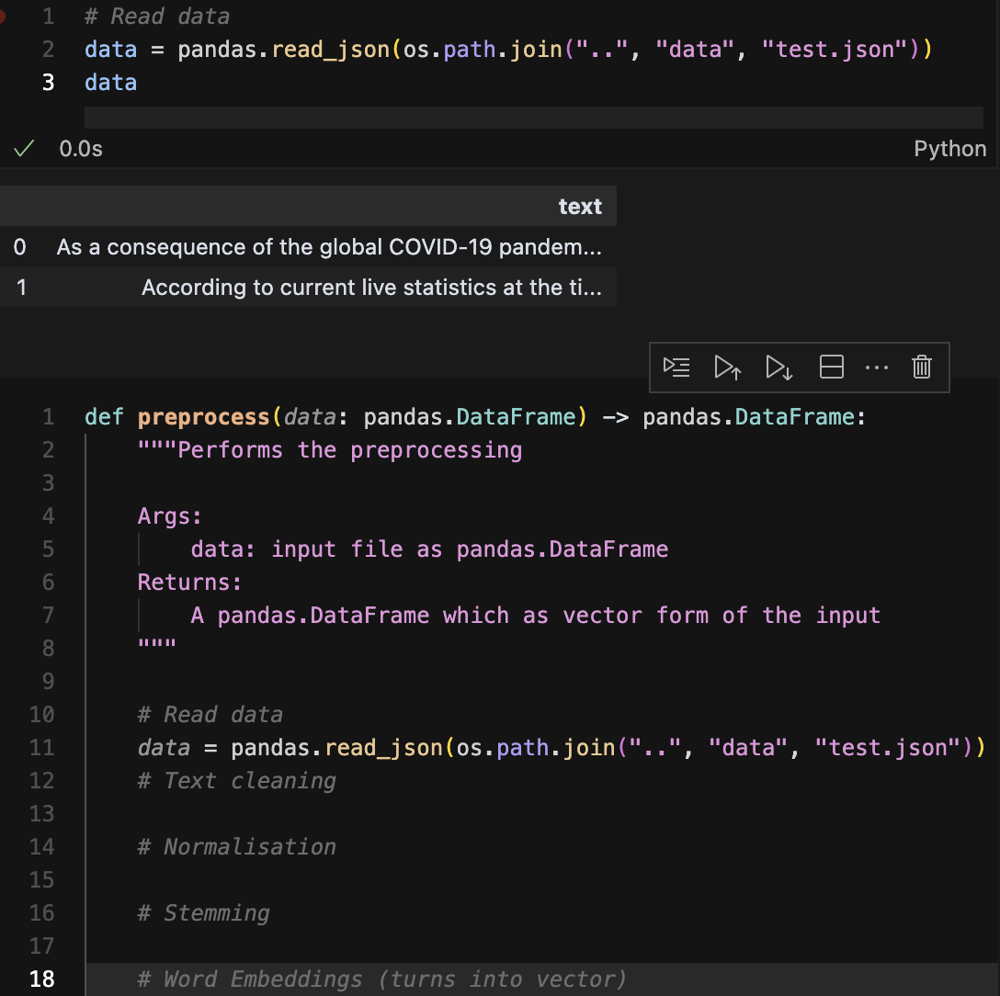
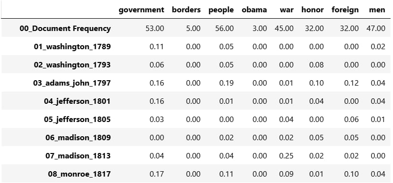

# Phase 1: Buidling preprocessing pipeline
Given the input file is "test.json", you will have to define a function that takes as input a collection of text and returns its vector representation.

For example,
    `def preprocess(data: pandas.DataFrame) -> pandas.DataFrame:`

This means, takes "data" whose type is pandas.DataFrame as input and returns a pandas.DataFrame as output which has the vector representation of the corpus.

To make it easy for you to get along with, you should follow this pipeline built by Gia Bảo. 



---

At this point, you have a basic idea of what needs to be done. So I will help you make the final step of summarising.

Your task is to define a function that takes a collection of text and returns its vector representation, here, TF-IDF is preferred. Your input is the file "test.json" and your output is a .csv file whose content is the TF-IDF form of the corpus.

To complete this task, follow the steps in the above picture. For example,

```
def preprocess(data: pandas.DataFrame) -> pandas.DataFrame:
    """Performs the preprocessing step
    
    Args:
        data: input file as pandas.DataFrame
    Returns:
        A pandas.DataFrame which is vector form of the input
    """

    # Read data

    # Text cleaning

    # Normalisation

    # Stemming

    ...

    # Word Embeddings (turns into vector)
``` 

Here, "# Read data" or "# Text cleaning" or "# Normalisation" are the smaller steps of the function. You can code these steps outside the functions and test them, when testing phase is done you can put it into the function. 



At illustrated in the image above, I code the step "Read Data" and test it, after ensuring that it performs well by printing the result, I put it into the function.

For further visualisation, the output should look like this, where column consists of words, row consists of documents and the entries are tf-idf values. 



Remember, after all the elements of the function is filled, you will have to test the function as a whole. 

Hope with this instruction can help you to learn and code. 

## Notes

- Feel free to ask the leader if you get into any problems.
- The pipeline depicted in the picture belongs to Gia Bảo, it is his work of effort, __DO NOT__ share without his permission.
- Do not put all the works until the final day of deadline, it is too dangerous as the preprocessing is one of the most important stage. 

# Phase 2: Fixing the preprocessing pipeline
To make it easier for you to fix and follow, I have uploaded my code in `code`, this folder currently has two files, one file named `./test.ipynb` whose content is the code of preprocessing and LDA (using pyspark), you can follow the steps in the `preprocess()` to fix your preprocessing as well as code of LDA to perform yours. The other file is `helper.py`, which is a python program helps me store essential functions. 

As always, let it be my pleasure to help you, but asking is a must so I can know what I can do. 

